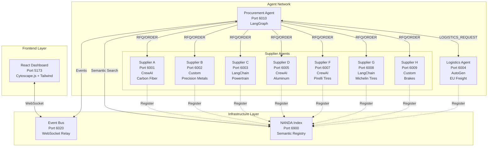
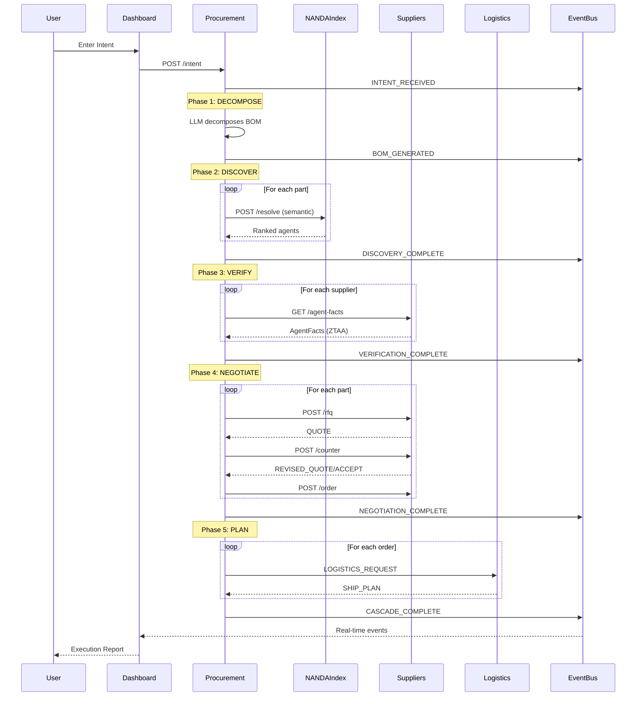

# OneClickAI — Supply Chain Agents

Multi-agent supply-chain coordination network built on a NANDA-inspired architecture. Nine autonomous agents (7 suppliers + procurement orchestrator + logistics planner) discover each other via a semantic registry, negotiate procurement deals through structured A2A messaging, and coordinate logistics — all visualized in real-time through a React dashboard.

## Architecture



### Coordination Cascade Sequence



## Hero Features

| # | Feature | Description |
|---|---------|-------------|
| 1 | **Discovery & Identity** | NANDA Lean Index with AgentAddr/AgentFacts schema, semantic skill search, ZTAA verification |
| 2 | **Coordination Cascade** | Full RFQ→QUOTE→COUNTER→ACCEPT→ORDER→SHIP_PLAN across 4 frameworks (LangGraph, CrewAI, Custom Python, LangChain/AutoGen) |
| 3 | **Visualization** | Real-time Cytoscape.js supply graph, message flow log, coordination timeline, execution summary with report download |

## Agent Framework Map

| Agent | Framework | Port | Skills |
|-------|-----------|------|--------|
| Procurement Orchestrator | **LangGraph** | 6010 | BOM decomposition, negotiation, orchestration |
| Supplier A — Carbon Fiber Specialists | **CrewAI** | 6001 | `supply:carbon_fiber_panels`, `supply:carbon_fiber_raw` |
| Supplier B — Precision Metals & Ceramics | **Custom Python** | 6002 | `supply:titanium_alloy`, `supply:titanium_fasteners`, `supply:ceramic_brake_calipers` |
| Supplier C — Powertrain Components | **LangChain** | 6003 | `supply:aluminum_engine_block`, `supply:turbocharger_assembly` |
| Supplier D — Aluminum & Materials | **CrewAI** | 6005 | `supply:aluminum_chassis`, `supply:carbon_composite`, `supply:magnesium_wheels` |
| Supplier F — Pirelli Tire Systems | **CrewAI** | 6007 | `supply:pirelli_p_zero`, `supply:pirelli_racing_slicks` |
| Supplier G — Michelin Tire Systems | **LangChain** | 6008 | `supply:michelin_pilot_sport`, `supply:michelin_racing_tires` |
| Supplier H — Brake Systems | **Custom Python** | 6009 | `supply:carbon_ceramic_brakes`, `supply:brake_calipers` |
| Logistics — EU Freight | **AutoGen** | 6004 | `logistics:road_freight_eu`, `logistics:express_delivery` |

## Quick Start

### Prerequisites

- Python 3.11+
- Node.js 18+
- OpenAI API key (set as `OPENAI_API_KEY` environment variable)
- MongoDB (optional — falls back to in-memory)

### 1. Install Python dependencies

```bash
pip install -r requirements.txt
```

### 2. Install dashboard dependencies

```bash
cd dashboard && npm install && cd ..
```

### 3. Set your OpenAI API key

```bash
export OPENAI_API_KEY="sk-..."
```

### 4. Start everything

```bash
chmod +x start_all.sh
./start_all.sh
```

This starts all 10 backend services + the React dashboard. Services:

| Service | URL | Framework |
|---------|-----|-----------|
| NANDA Index | http://localhost:6900 | FastAPI + MongoDB |
| Event Bus | http://localhost:6020 (WS: ws://localhost:6020/ws) | FastAPI + WebSocket |
| Supplier A — Carbon Fiber | http://localhost:6001 | CrewAI |
| Supplier B — Precision Metals | http://localhost:6002 | Custom Python |
| Supplier C — Powertrain | http://localhost:6003 | LangChain |
| Logistics Agent | http://localhost:6004 | AutoGen |
| Supplier D — Aluminum | http://localhost:6005 | CrewAI |
| Supplier F — Pirelli Tires | http://localhost:6007 | CrewAI |
| Supplier G — Michelin Tires | http://localhost:6008 | LangChain |
| Supplier H — Brakes | http://localhost:6009 | Custom Python |
| Procurement Agent | http://localhost:6010 | LangGraph |
| Dashboard | http://localhost:5173 | React + Vite |

### 5. Run the cascade

Open the dashboard at http://localhost:5173 and type a procurement intent, or use the test script:

```bash
python3 test_cascade.py
```

### 6. Stop all services

```bash
./start_all.sh --stop
```

## Docker Compose (alternative)

```bash
export OPENAI_API_KEY="sk-..."
docker compose up --build
```

## Project Structure

```
hackathon/
├── shared/                 # Pydantic schemas, message types, config
│   ├── schemas.py          # AgentAddr, AgentFacts, Skill, etc.
│   ├── message_types.py    # Envelope, RFQ, QUOTE, ORDER, etc.
│   └── config.py           # Ports, URLs, constants
├── nanda-index/            # NANDA Lean Index (FastAPI + MongoDB)
│   └── registry.py         # register, search, lookup, list, stats
├── event-bus/              # WebSocket relay for dashboard
│   └── server.py           # POST /event → broadcast to WS /ws
├── agents/
│   ├── procurement/        # LangGraph orchestrator
│   │   ├── agent.py        # 5-node state machine
│   │   ├── bom.py          # LLM-powered BOM decomposition
│   │   ├── negotiation.py  # Scoring, counter-offers, selection
│   │   └── server.py       # FastAPI server + NANDA registration
│   ├── supplier/           # 8 supplier agents (3 frameworks)
│   │   ├── inventory.py            # Simulated catalogues for all suppliers
│   │   ├── supplier_crewai.py      # Supplier A - CrewAI (port 6001)
│   │   ├── supplier_custom.py      # Supplier B - Custom (port 6002)
│   │   ├── supplier_langchain.py   # Supplier C - LangChain (port 6003)
│   │   ├── supplier_aluminum.py    # Supplier D - CrewAI (port 6005)
│   │   ├── supplier_pirelli.py     # Supplier F - CrewAI (port 6007)
│   │   ├── supplier_michelin.py    # Supplier G - LangChain (port 6008)
│   │   └── supplier_brakes.py      # Supplier H - Custom (port 6009)
│   └── logistics/          # AutoGen route planner
│       └── agent.py        # Dijkstra routing + LLM reasoning
├── dashboard/              # React + Cytoscape.js + Tailwind CSS
│   └── src/
│       ├── App.tsx
│       ├── components/     # SupplyGraph, MessageFlow, Timeline, etc.
│       ├── hooks/          # useWebSocket, useDashboardState
│       └── types.ts
├── docker-compose.yml      # Full Docker orchestration
├── Dockerfile.agent        # Shared Python agent image
├── start_all.sh            # Local startup script
├── test_cascade.py         # End-to-end integration test
└── requirements.txt        # Python dependencies
```

## Coordination Cascade Flow

1. **DECOMPOSE** — User submits intent → GPT-4o decomposes into Bill of Materials (~8 parts)
2. **DISCOVER** — Query NANDA Index `POST /resolve` with semantic matching per part → get ranked AgentAddr list
3. **VERIFY** — Fetch AgentFacts from each supplier → ZTAA checks (reliability > 0.85, ESG rating, jurisdiction, certifications)
4. **NEGOTIATE** — Send RFQs → collect QUOTEs → rank with weighted scoring → COUNTER_OFFER (10% discount) to top supplier → ACCEPT/REJECT → place ORDERs
5. **PLAN** — Send LOGISTICS_REQUESTs → Dijkstra routing + carrier selection → receive SHIP_PLANs → generate Network Coordination Report

## Scoring Weights (Negotiation)

| Factor | Weight |
|--------|--------|
| Price | 30% |
| Lead Time | 25% |
| Reliability | 20% |
| ESG Rating | 15% |
| Proximity | 10% |

## NANDA Protocol

Each agent implements the NANDA protocol:
- **Self-hosts AgentFacts** at `GET /agent-facts` (rich metadata: skills, certifications, evaluations, policies)
- **Registers** with the NANDA Lean Index at startup (lightweight AgentAddr record with skill descriptions)
- **Semantic discovery** via OpenAI embeddings (text-embedding-3-small) with context-aware ranking
- **Communicates** via typed A2A message envelopes (10 message types: RFQ, QUOTE, COUNTER_OFFER, etc.)

## Documentation

- **[Architecture Guide](docs/ARCHITECTURE.md)** — Deep-dive into system design, service catalog, protocols, and data flows
- **[Supplier Creation Guide](docs/SUPPLIER_GUIDE.md)** — Step-by-step guide to creating new supplier agents
- **[Feature Reference](docs/FEATURES.md)** — Detailed documentation of all hero features and stretch goals
- **[Semantic Resolver Implementation](SEMANTIC_RESOLVER_IMPLEMENTATION.md)** — Technical details on semantic matching and adaptive resolution

## Tech Stack

**Backend**: Python 3.11, FastAPI, Pydantic v2, httpx, OpenAI GPT-4o
**Agent Frameworks**: LangGraph, CrewAI, LangChain, AutoGen (pyautogen)
**Frontend**: React 19, TypeScript, Vite, Cytoscape.js, Tailwind CSS 4
**Infrastructure**: MongoDB (optional), WebSocket event bus, Docker Compose
