# System Architecture

Deep-dive technical documentation for the OneClickAI multi-agent supply chain coordination network.

## Table of Contents

- [System Overview](#system-overview)
- [Service Catalog](#service-catalog)
- [NANDA Protocol](#nanda-protocol)
- [A2A Message Protocol](#a2a-message-protocol)
- [Event Bus Architecture](#event-bus-architecture)
- [Coordination Cascade](#coordination-cascade)
- [Negotiation Scoring](#negotiation-scoring)
- [Logistics Routing](#logistics-routing)
- [Dashboard Architecture](#dashboard-architecture)
- [End-to-End Data Flow](#end-to-end-data-flow)

---

## System Overview

OneClickAI is a distributed multi-agent system demonstrating NANDA-inspired agent discovery and coordination primitives for supply chain orchestration. The architecture consists of three layers:

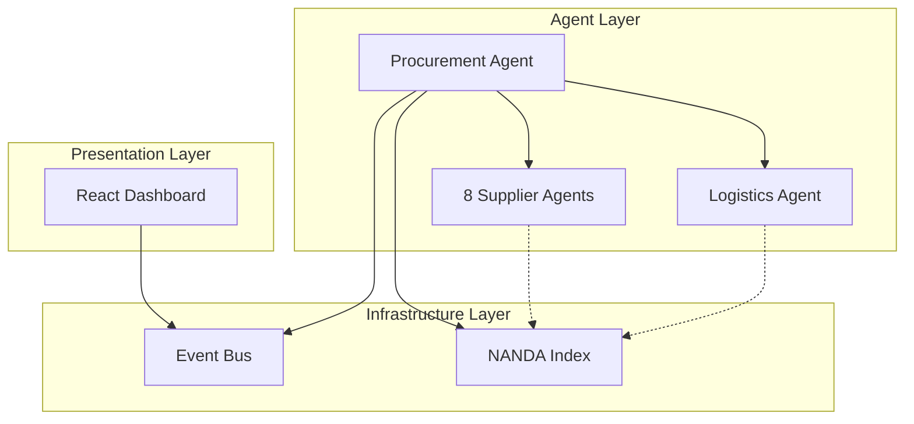

### Design Principles

1. **Agent Autonomy** — Each agent is an independent service with its own state, logic, and framework
2. **Semantic Discovery** — Agents find each other by capability (skills) rather than hardcoded URLs
3. **Zero Trust** — Every agent verifies partners through AgentFacts metadata (ZTAA)
4. **Event-Driven** — All coordination actions are logged to an event bus for observability
5. **Framework Agnostic** — Agents can use different AI frameworks (LangGraph, CrewAI, LangChain, AutoGen, Custom)

---

## Service Catalog

| Service | Port | Framework | Responsibility | Health Endpoint |
|---------|------|-----------|----------------|-----------------|
| **NANDA Index** | 6900 | FastAPI + MongoDB | Agent registry, semantic skill search, AgentAddr storage | `GET /health` |
| **Event Bus** | 6020 | FastAPI + WebSocket | Event relay, real-time dashboard updates, history | `GET /health` |
| **Procurement Agent** | 6010 | LangGraph | Orchestrate 5-phase cascade, BOM decomposition, negotiation | `GET /health` |
| **Supplier A** | 6001 | CrewAI | Carbon fiber panels, raw carbon fiber | `GET /health` |
| **Supplier B** | 6002 | Custom Python | Titanium alloys, fasteners, ceramic brake calipers | `GET /health` |
| **Supplier C** | 6003 | LangChain | Aluminum engine blocks, turbocharger assemblies | `GET /health` |
| **Logistics Agent** | 6004 | AutoGen | EU road freight routing (Dijkstra + LLM), carrier selection | `GET /health` |
| **Supplier D** | 6005 | CrewAI | Aluminum chassis, carbon composites, magnesium wheels | `GET /health` |
| **Supplier F** | 6007 | CrewAI | Pirelli P Zero tires, racing slicks | `GET /health` |
| **Supplier G** | 6008 | LangChain | Michelin Pilot Sport tires, racing tires | `GET /health` |
| **Supplier H** | 6009 | Custom Python | Carbon ceramic brakes, brake calipers | `GET /health` |
| **Dashboard** | 5173 | React 19 + Vite | Real-time visualization, graph navigation, execution reports | N/A (client-side) |

### Startup Order

Services must start in this order to satisfy dependencies:

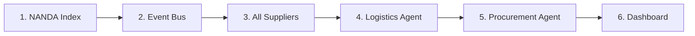

---

## NANDA Protocol

The NANDA (Network Agent Discovery and Addressing) protocol enables decentralized agent discovery and verification.

### Two-Tier Metadata Architecture

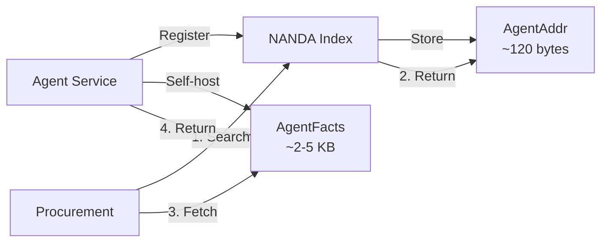

#### AgentAddr (Lean Index Record)

Stored in the NANDA Index for fast search and filtering:

```python
# Schema: shared/schemas.py
class AgentAddr:
    agent_id: str           # Unique identifier
    agent_name: str         # Display name
    facts_url: str          # URL to fetch full AgentFacts
    skills: list[str]       # Skill IDs (e.g., 'supply:carbon_fiber_panels')
    region: str | None      # Geographic region (e.g., 'EU')
    ttl: int                # Time-to-live in seconds (default 3600)
    registered_at: datetime # Registration timestamp
    signature: str | None   # Cryptographic signature (future)
```

#### AgentFacts (Rich Self-Hosted Metadata)

Self-hosted by each agent at `GET /agent-facts`:

```python
# Schema: shared/schemas.py
class AgentFacts:
    id: str                           # Same as agent_id
    agent_name: str
    label: str                        # Short UI label
    description: str                  # Detailed purpose
    version: str
    framework: str                    # crewai, langchain, autogen, langgraph, custom
    jurisdiction: str                 # Legal jurisdiction
    provider: str                     # Organization
    skills: list[Skill]               # Full skill details
    endpoints: list[Endpoint]         # API endpoints
    evaluations: list[Evaluation]     # Trust scores
    certifications: list[Certification] # ISO 9001, REACH, etc.
    policies: list[Policy]            # Pricing, MOQ, data handling
    reliability_score: float          # 0-1 self-reported
    esg_rating: str                   # A-F scale
    base_url: str
```

### Registration Flow

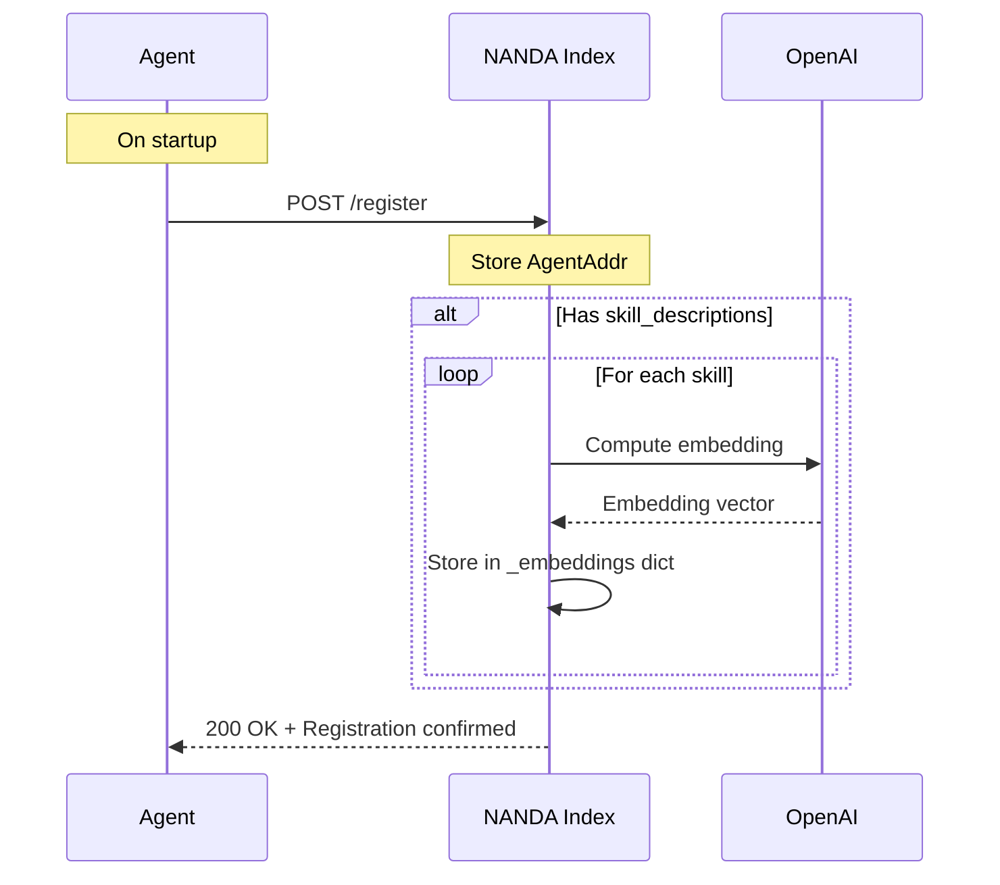

### Semantic Discovery with `/resolve`

The `/resolve` endpoint combines semantic matching with context-aware scoring:

**Request:**
```json
POST /resolve
{
  "query": "lightweight composite materials for vehicle body",
  "skill_hint": "",  // Optional exact skill ID for fast path
  "context": {
    "region": "EU",
    "compliance_requirements": ["ISO 9001", "REACH"],
    "max_lead_time_days": 21,
    "urgency": "standard"
  },
  "min_score": 0.65
}
```

**Resolution Strategy (3 phases):**

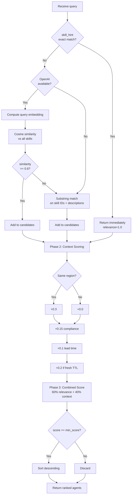

**Response:**
```json
[
  {
    "agent_id": "supplier-a",
    "agent_name": "Carbon Fiber Specialists",
    "facts_url": "http://localhost:6001/agent-facts",
    "matched_skill": "supply:carbon_fiber_panels",
    "match_reason": "semantic",
    "relevance_score": 0.87,
    "context_score": 0.65,
    "combined_score": 0.78
  }
]
```

### ZTAA Verification Flow

Zero Trust Agent Architecture — never trust, always verify:

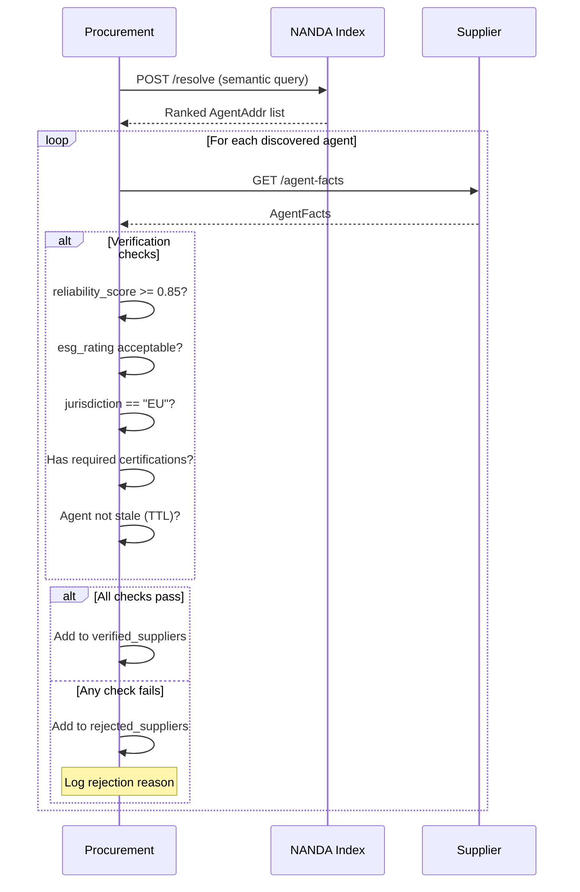

---

## A2A Message Protocol

All inter-agent communication uses typed message envelopes defined in [`shared/message_types.py`](../shared/message_types.py).

### Envelope Structure

```python
class Envelope:
    message_id: str         # UUID
    type: MessageType       # Discriminator
    from_agent: str         # Sender agent_id
    to_agent: str           # Recipient agent_id
    timestamp: datetime     # UTC timestamp
    correlation_id: str     # Links all messages in a negotiation
    payload: dict[str, Any] # Type-specific payload
```

### Message Types

| Type | Direction | Purpose | Payload Model |
|------|-----------|---------|---------------|
| `RFQ` | Procurement → Supplier | Request For Quotation | `RFQPayload` |
| `QUOTE` | Supplier → Procurement | Price quote response | `QuotePayload` |
| `COUNTER_OFFER` | Procurement → Supplier | Counter-offer with target price | `CounterOfferPayload` |
| `REVISED_QUOTE` | Supplier → Procurement | Revised quote after counter | `RevisedQuotePayload` |
| `ACCEPT` | Procurement → Supplier | Accept quote, create order | `AcceptPayload` |
| `REJECT` | Either direction | Reject quote or counter | `RejectPayload` |
| `ORDER` | Procurement → Supplier | Confirmed purchase order | `OrderPayload` |
| `LOGISTICS_REQUEST` | Procurement → Logistics | Request shipping plan | `LogisticsRequestPayload` |
| `SHIP_PLAN` | Logistics → Procurement | Shipping route and cost | `ShipPlanPayload` |
| `EVENT` | Any → Event Bus | Generic event for dashboard | `EventPayload` |

### Message Flow Example

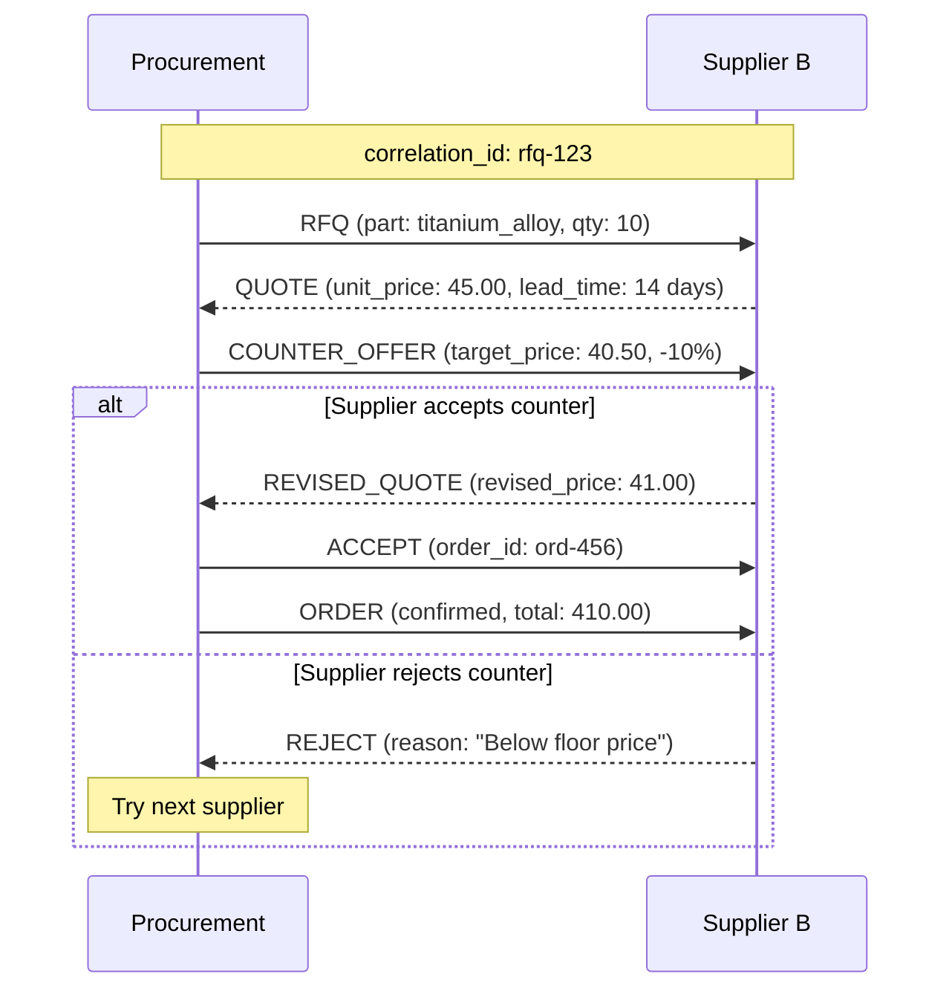

### Correlation ID Tracing

The `correlation_id` field links all messages in a single negotiation thread, enabling:
- Dashboard message grouping
- Request/response matching
- Negotiation round tracking
- Audit trail reconstruction

---

## Event Bus Architecture

The Event Bus (`event-bus/server.py`) provides real-time event streaming to the dashboard using WebSocket.

### Architecture

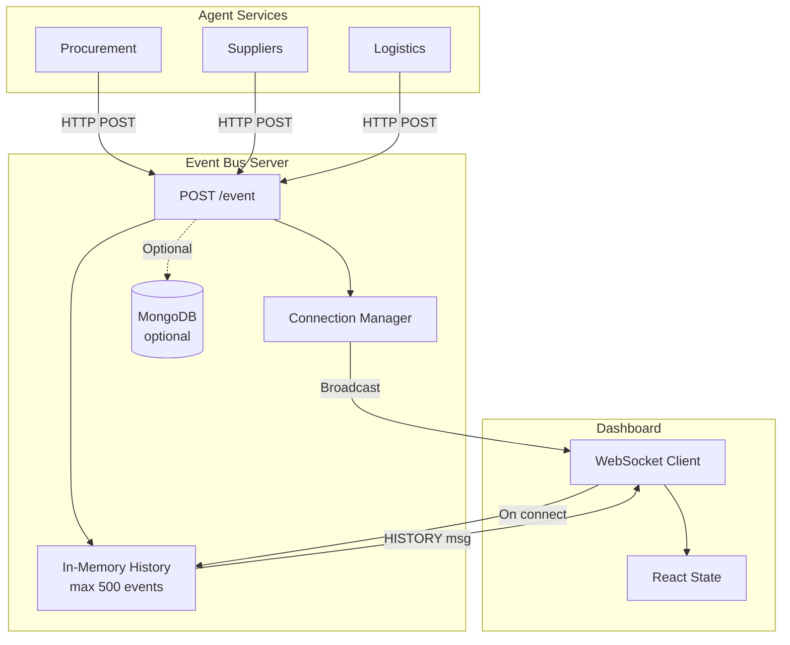

### Event Structure

```python
{
  "event_type": str,        # e.g., 'RFQ_SENT', 'QUOTE_RECEIVED', 'ORDER_PLACED'
  "agent_id": str,          # Agent that generated the event
  "timestamp": str,         # ISO-8601 UTC timestamp
  "data": dict[str, Any],   # Event-specific data
  "run_id": str             # Dashboard run/tab identifier
}
```

### Key Event Types

| Event Type | Emitted By | Trigger | Dashboard Impact |
|------------|------------|---------|------------------|
| `INTENT_RECEIVED` | Procurement | User submits intent | Timeline: start intent phase |
| `BOM_GENERATED` | Procurement | LLM decomposes BOM | Show BOM parts |
| `DISCOVERY_COMPLETE` | Procurement | All parts searched | Timeline: complete discovery |
| `AGENT_VERIFIED` | Procurement | Supplier passes ZTAA | Add supplier node to graph |
| `AGENT_REJECTED` | Procurement | Supplier fails ZTAA | Log rejection |
| `RFQ_SENT` | Procurement | RFQ posted to supplier | Add RFQ edge to graph |
| `QUOTE_RECEIVED` | Supplier | Quote sent back | Add quote edge, log message |
| `COUNTER_SENT` | Procurement | Counter-offer sent | Add counter edge |
| `ORDER_PLACED` | Procurement | Order confirmed | Add order edge, update timeline |
| `SHIP_PLAN_RECEIVED` | Procurement | Logistics returns plan | Add logistics detail |
| `CASCADE_COMPLETE` | Procurement | All phases done | Timeline: complete, auto-disconnect |

### Run Isolation

The dashboard supports multiple concurrent runs (browser tabs) using `run_id`:
- Each intent generates a new `run_id` (UUID)
- Events include `run_id` in their `data` payload
- Dashboard filters events by `run_id` for tab isolation
- Event Bus stores all runs; dashboard fetches relevant history on connect

### MongoDB Persistence

Optional persistence layer:
- Stores all events with TTL (default: 7 days)
- Enables historical analysis across sessions
- Gracefully degrades to in-memory if MongoDB unavailable
- Indexed on: `run_id`, `agent_id`, `timestamp`

---

## Coordination Cascade

The Procurement Agent orchestrates a 5-phase coordination cascade using a LangGraph state machine.

### State Machine

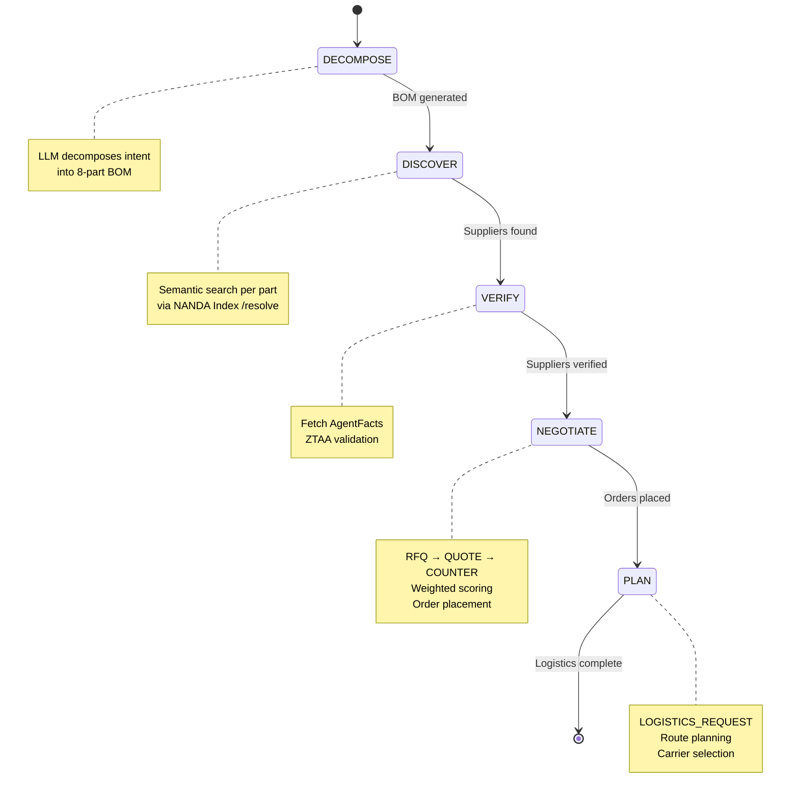

### Phase Details

#### Phase 1: DECOMPOSE

**File:** `agents/procurement/bom.py`

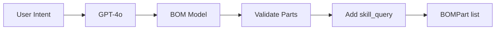

**Key logic:**
- Context-aware prompts (automotive, beverages, electronics)
- Generates 8 parts with: `part_id`, `part_name`, `description`, `system`, `quantity`, `skill_query`, `compliance_requirements`, `specs`
- Fallback template if LLM fails
- Validation ensures `skill_query` has `supply:` or `logistics:` prefix

#### Phase 2: DISCOVER

**File:** `agents/procurement/agent.py` (lines 219-340)

**For each BOM part:**
```python
# Build semantic query from part metadata
query = f"{part.part_name} - {part.description}"

# Call NANDA Index semantic resolver
response = await httpx.post(
    f"{INDEX_URL}/resolve",
    json={
        "query": query,
        "skill_hint": part.skill_query,  # Fast path optimization
        "context": {
            "region": "EU",
            "compliance_requirements": part.compliance_requirements,
            "urgency": "standard",
        },
        "min_score": 0.65,
    }
)

# Store ranked suppliers per part
discovered_suppliers[part.skill_query] = response.json()
```

**Parallelization:** All parts searched concurrently (async tasks)

#### Phase 3: VERIFY

**File:** `agents/procurement/agent.py` (lines 342-465)

**For each discovered supplier:**
```python
# Fetch full AgentFacts
facts = await httpx.get(f"{agent_addr['facts_url']}")

# ZTAA checks
if facts['reliability_score'] < 0.85:
    reject("Low reliability")
elif facts['jurisdiction'] != "EU":
    reject("Wrong jurisdiction")
elif not all(cert in facts['certifications'] for cert in required_certs):
    reject("Missing certifications")
else:
    verified_suppliers[agent_id] = facts
```

#### Phase 4: NEGOTIATE

**File:** `agents/procurement/agent.py` (lines 467-773)

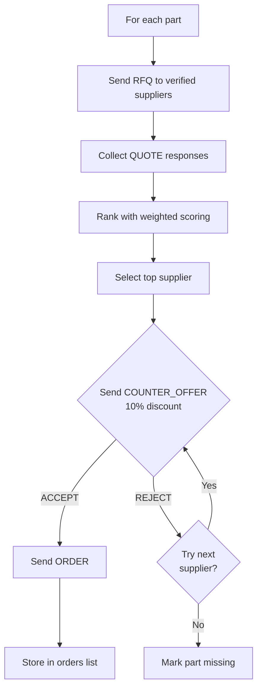

**Weighted Scoring Formula:**

See [Negotiation Scoring](#negotiation-scoring) section below.

#### Phase 5: PLAN

**File:** `agents/procurement/agent.py` (lines 775-889)

**For each placed order:**
```python
# Build logistics request
logistics_request = LogisticsRequestPayload(
    order_id=order['order_id'],
    pickup_location=order['shipping_origin'],
    delivery_location="Stuttgart, Germany",
    cargo_description=order['part'],
    weight_kg=50.0,  # Estimated
    required_by=order['required_by'],
    priority="standard",
)

# Send to logistics agent
ship_plan = await httpx.post(
    "http://localhost:6004/logistics",
    json=make_envelope(
        MessageType.LOGISTICS_REQUEST,
        from_agent="procurement-agent",
        to_agent="logistics-agent",
        payload=logistics_request,
    )
)

# Store ship plan
logistics_plans.append(ship_plan.json())
```

---

## Negotiation Scoring

Suppliers are ranked using a weighted multi-criteria scoring function.

### Scoring Formula

```
total_score = 0.30 × price_score
            + 0.25 × lead_time_score
            + 0.20 × reliability_score
            + 0.15 × esg_score
            + 0.10 × proximity_score
```

### Dimension Normalization

**File:** `agents/procurement/negotiation.py` (lines 104-159)

```python
def score_quote(quote, max_price, max_lead_time, delivery_region):
    # Price: lower is better → invert
    price_score = 1.0 - (quote.unit_price / max_price)
    
    # Lead time: lower is better → invert
    lead_time_score = 1.0 - (quote.lead_time_days / max_lead_time)
    
    # Reliability: direct from AgentFacts
    reliability_score = quote.reliability_score
    
    # ESG: map letter grade to 0-1
    esg_score = ESG_SCORES.get(quote.esg_rating, 0.5)
    # ESG_SCORES = {"A+": 1.0, "A": 0.9, "B": 0.7, "C": 0.5, "F": 0.1}
    
    # Proximity: binary same-region check
    proximity_score = 1.0 if quote.region == delivery_region else 0.4
    
    return (
        0.30 * price_score +
        0.25 * lead_time_score +
        0.20 * reliability_score +
        0.15 * esg_score +
        0.10 * proximity_score
    )
```

### Counter-Offer Logic

```python
# Request 10% discount
target_price = quote.unit_price * 0.90

counter_offer = CounterOfferPayload(
    rfq_id=quote.rfq_id,
    target_price=target_price,
    flexible_date=False,
    justification="Competitive market benchmark",
)

# Supplier evaluates against floor price
# Floor price = base_price × floor_price_pct (typically 80%)
if target_price >= part_info.floor_price:
    return REVISED_QUOTE  # Accept
else:
    return REJECT  # Below floor
```

### Tie-Breaking

If multiple suppliers have the same score:
1. Prefer higher ESG rating
2. Then prefer higher reliability score
3. Then prefer lower unit price

---

## Logistics Routing

The Logistics Agent combines graph algorithms with LLM reasoning for intelligent route planning.

### EU Road Network

**File:** `agents/logistics/agent.py`

- **30 cities**: Stuttgart, Munich, Frankfurt, Düsseldorf, Hamburg, Berlin, Cologne, Vienna, Zurich, Milan, Paris, Brussels, Amsterdam, Lyon, Prague, Warsaw, Budapest, Bratislava, Barcelona, Madrid, etc.
- **44 road segments**: Each with `distance_km` and `transit_hours`
- **Graph representation**: Adjacency list (undirected)

### Dijkstra's Algorithm

**File:** `agents/logistics/agent.py` (lines 312-376)

```python
def find_shortest_route(origin, destination, weight="distance_km"):
    """Find shortest path using Dijkstra's algorithm.
    
    Args:
        origin, destination: Canonical city names
        weight: "distance_km" or "transit_hours" to minimize
    
    Returns:
        {
            "route": ["Stuttgart", "Munich", "Vienna"],
            "total_distance_km": 667.0,
            "total_transit_hours": 8.5
        }
    """
    heap = [(0.0, origin, [origin], 0.0, 0.0)]  # (cost, city, path, dist, hours)
    visited = set()
    
    while heap:
        cost, current, path, dist, hours = heapq.heappop(heap)
        if current in visited:
            continue
        visited.add(current)
        
        if current == destination:
            return {
                "route": path,
                "total_distance_km": round(dist, 1),
                "total_transit_hours": round(hours, 1),
            }
        
        for neighbor, seg_dist, seg_hours in adjacency[current]:
            if neighbor not in visited:
                edge_cost = seg_dist if weight == "distance_km" else seg_hours
                heapq.heappush(heap, (
                    cost + edge_cost,
                    neighbor,
                    path + [neighbor],
                    dist + seg_dist,
                    hours + seg_hours,
                ))
    
    return None  # No path found
```

### Carrier Selection

**4 carriers** with different pricing models:

| Carrier | Base Cost (€/km) | Express Multiplier | Weight Surcharge (€/kg) | Reliability | Regions |
|---------|------------------|---------------------|-------------------------|-------------|---------|
| DB Schenker | 1.20 | 1.6 | 0.020 | 94% | EU |
| DHL Freight | 1.35 | 1.5 | 0.015 | 96% | EU, US |
| DACHSER | 1.10 | 1.7 | 0.025 | 92% | EU |
| Kuehne+Nagel | 1.45 | 1.4 | 0.010 | 97% | EU, US, APAC |

**Selection Algorithm:**

```python
def select_best_carrier(distance_km, weight_kg, priority):
    """Balance cost and reliability (60% cost + 40% reliability)."""
    quotes = calculate_shipping_cost(distance_km, weight_kg, priority)
    
    max_cost = max(q['total_cost'] for q in quotes)
    best_score = -1.0
    best_carrier = None
    
    for quote in quotes:
        cost_score = 1.0 - (quote['total_cost'] / max_cost)
        reliability_score = quote['reliability']
        combined = 0.6 * cost_score + 0.4 * reliability_score
        
        if combined > best_score:
            best_score = combined
            best_carrier = quote
    
    return best_carrier
```

### AutoGen LLM Enhancement

**File:** `agents/logistics/agent.py` (lines 485-574)

After computing the algorithmic route and carrier selection, an AutoGen `ConversableAgent` adds natural language reasoning:

```python
async def _plan_with_autogen(pickup, delivery, cargo, weight_kg, priority,
                              route_data, carrier_quotes, best_carrier):
    """Use AutoGen ConversableAgent for LLM reasoning."""
    
    planner = ConversableAgent(
        name="route_planner",
        system_message=ROUTE_PLANNER_SYSTEM_PROMPT,
        llm_config={
            "config_list": [{"model": "gpt-4o", "api_key": api_key}],
            "temperature": 0.1,
        },
        human_input_mode="NEVER",
    )
    
    request_message = f"""
    Plan this shipment:
    - Pickup: {pickup}
    - Delivery: {delivery}
    - Cargo: {cargo}
    - Weight: {weight_kg} kg
    - Priority: {priority}
    
    Computed route: {json.dumps(route_data)}
    Carrier cost estimates: {json.dumps(carrier_quotes)}
    Recommended carrier: {best_carrier['carrier']} at €{best_carrier['total_cost']}
    
    Provide your shipping plan as a JSON object with:
    - carrier: selected carrier name
    - mode: road_freight or express_delivery
    - route_notes: 1-2 sentence route reasoning
    - carrier_notes: 1-2 sentence carrier reasoning
    - risk_notes: any risk factors or considerations
    """
    
    reply = await asyncio.to_thread(planner.generate_reply, 
                                     messages=[{"role": "user", "content": request_message}])
    
    return json.loads(reply)  # Parse JSON response
```

**LLM adds value by:**
- Explaining route choice (e.g., "Direct route via Munich avoids alpine passes")
- Justifying carrier selection (e.g., "DHL chosen for higher reliability despite 5% cost premium")
- Identifying risks (e.g., "Border delays possible due to customs checks")

### Transit Time Calculation

```python
# EU driver regulations
driving_hours_per_day = 9.0 if mode == "road_freight" else 14.0
transit_days = max(1, int(transit_hours / driving_hours_per_day + 0.99))
```

---

## Dashboard Architecture

The dashboard is a React 19 app using TypeScript, Vite, Tailwind CSS 4, and Cytoscape.js.

### Component Hierarchy

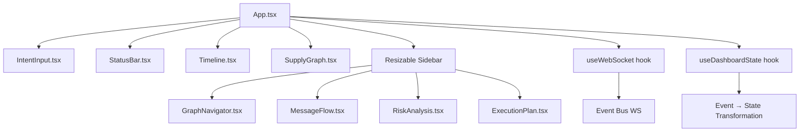

### State Management

**Hook: `useWebSocket`** (`hooks/useWebSocket.ts`)

Responsibilities:
- Connect to `ws://localhost:6020/ws`
- Handle HISTORY message (batch of recent events on connect)
- Accumulate events in React state
- Reconnect with exponential backoff (1s → 15s max)
- HTTP fallback (`GET /events?limit=500`) if WebSocket fails
- Auto-disconnect when cascade completes

**Hook: `useDashboardState`** (`hooks/useDashboardState.ts`)

Responsibilities:
- Filter events by `runId` for tab isolation
- Transform events into graph nodes and edges
- Build message log with human-readable summaries
- Track timeline phases (intent → bom → discovery → ... → complete)
- Compute execution plan (orders, ship plans, costs, negotiations)
- Handle disruption/rerouting events

**Transformation Pipeline:**

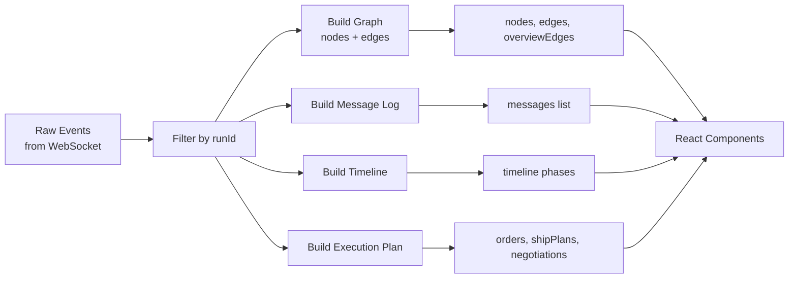

### Graph Visualization

**Component: `SupplyGraph`** (`components/SupplyGraph.tsx`, 1445 lines)

Uses Cytoscape.js with custom styling:

**Node types:**
- **Procurement** — Purple rounded rect with shopping cart icon
- **Supplier** — Green rounded rect with factory icon
- **Logistics** — Orange rounded rect with truck icon
- **Index** — Pink rounded rect with search icon
- **Hub** (logistics cities) — Gray circles

**Edge types:**
- **Discovery** — Dashed purple (procurement → supplier search)
- **RFQ** — Solid blue (procurement → supplier request)
- **Quote** — Solid green (supplier → procurement response)
- **Counter** — Dashed orange (procurement → supplier negotiation)
- **Accept** — Solid bright green (procurement → supplier acceptance)
- **Order** — Solid cyan (procurement → supplier confirmed order)
- **Logistics** — Solid orange (procurement ↔ logistics)
- **Route** — Solid orange with waypoint labels (logistics routing)

**View modes:**
1. **Overview** — Full network graph
2. **Agent detail** — Focus on one agent's interactions
3. **Order detail** — Contract relationships for one order
4. **Logistics detail** — Route with city waypoints
5. **Part focused** — Suppliers for specific BOM part

**Analytics overlays:**
- **Cost heatmap** — Nodes colored by total spend (green → red gradient)
- **Lead time heatmap** — Nodes colored by delivery speed (green → red)
- **Risk concentration** — Highlights single points of failure

### WebSocket Event Flow

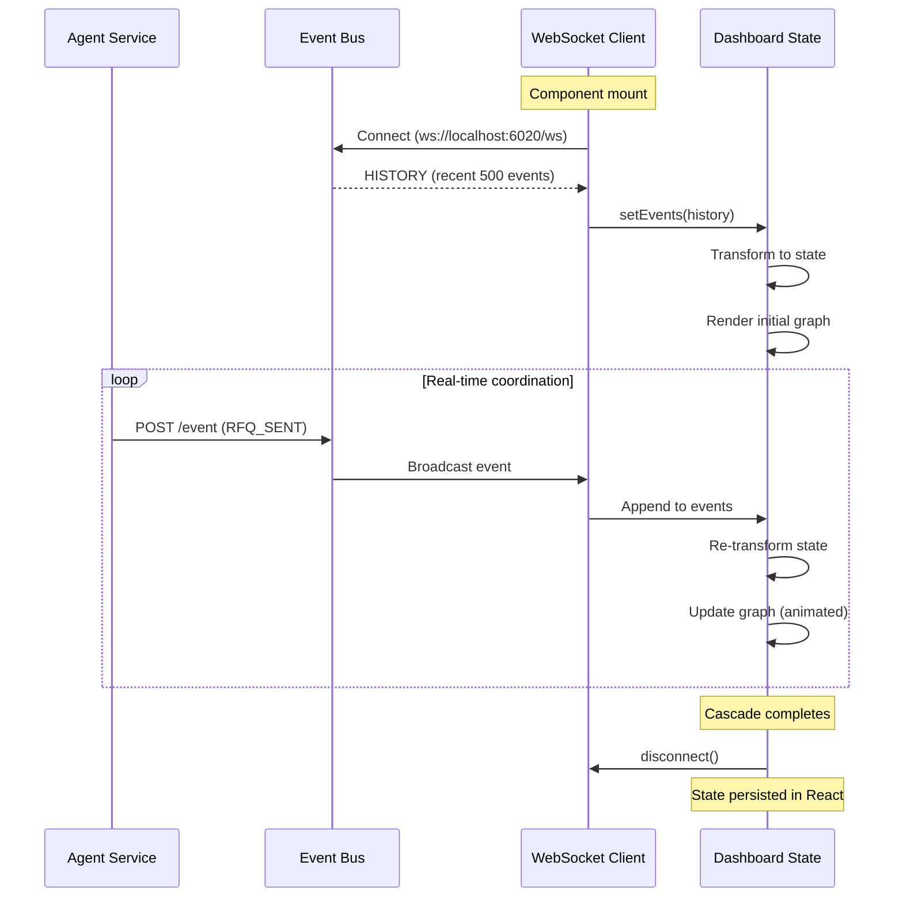

---

## End-to-End Data Flow

Complete system trace from user intent to execution report:

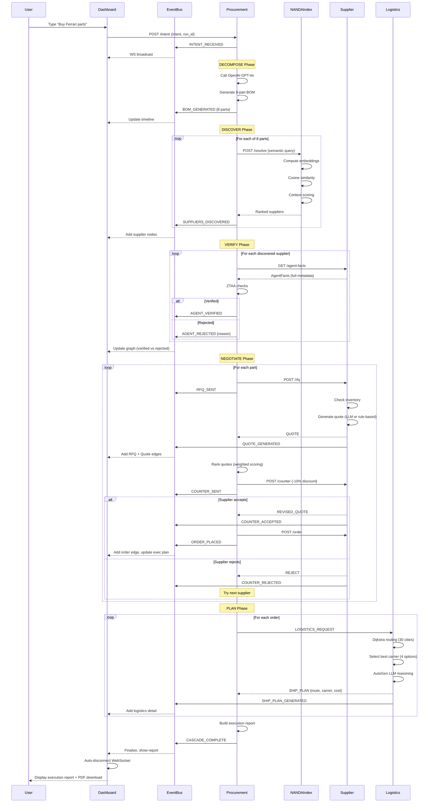

**Typical timeline:**
- User input to BOM generation: ~3 seconds (OpenAI call)
- Discovery per part: ~100ms (semantic search)
- Verification per supplier: ~50ms (HTTP GET)
- Negotiation per part: ~500ms (RFQ → Quote → Counter → Order)
- Logistics per order: ~200ms (Dijkstra + carrier selection)
- **Total cascade: 15-30 seconds** for 8 parts, 8 suppliers, 8 orders

---

## Configuration Reference

All configuration lives in [`shared/config.py`](../shared/config.py):

```python
# NANDA Lean Index
INDEX_HOST = "localhost"
INDEX_PORT = 6900
INDEX_URL = "http://localhost:6900"

# Agent Ports
PROCUREMENT_PORT = 6010
LOGISTICS_PORT = 6004
SUPPLIER_PORTS = {
    "supplier_a": 6001,  # CrewAI - Carbon Fiber
    "supplier_b": 6002,  # Custom - Precision Metals
    "supplier_c": 6003,  # LangChain - Powertrain
    "supplier_d": 6005,  # CrewAI - Aluminum
    "supplier_f": 6007,  # CrewAI - Pirelli Tires
    "supplier_g": 6008,  # LangChain - Michelin Tires
    "supplier_h": 6009,  # Custom - Brakes
}

# Event Bus
EVENT_BUS_PORT = 6020
EVENT_BUS_HTTP_URL = "http://localhost:6020"
EVENT_BUS_WS_URL = "ws://localhost:6020/ws"

# LLM
OPENAI_MODEL = "gpt-4o"

# Defaults
DEFAULT_CURRENCY = "EUR"
DEFAULT_TTL_SECONDS = 3600  # AgentAddr TTL
```

---

## Further Reading

- **[Supplier Creation Guide](SUPPLIER_GUIDE.md)** — How to add new supplier agents
- **[Feature Reference](FEATURES.md)** — Detailed feature documentation
- **[Semantic Resolver Implementation](../SEMANTIC_RESOLVER_IMPLEMENTATION.md)** — Technical deep-dive on semantic matching
